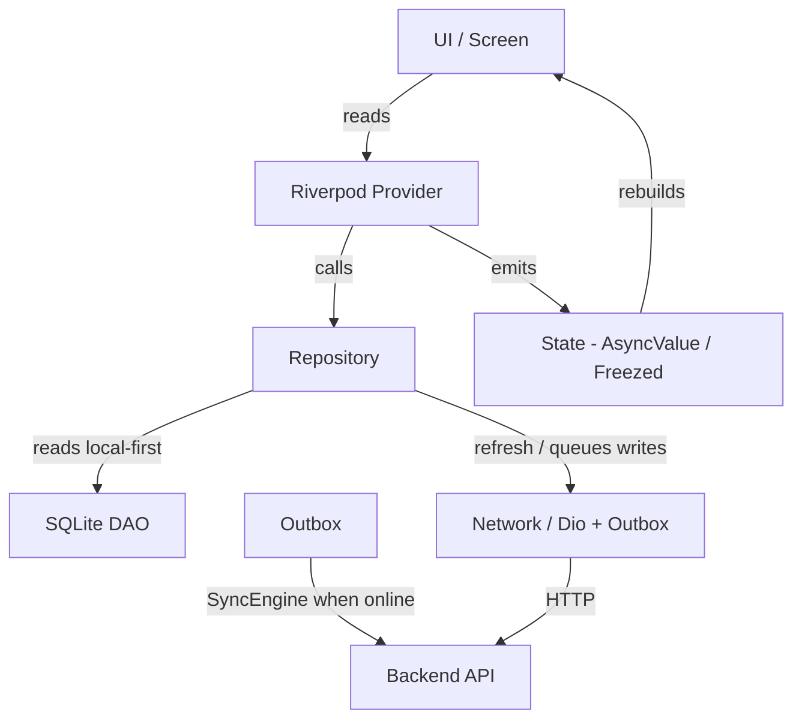

# Architecture

## Overview

FinTribe follows **Clean Architecture** principles combined with a
**feature-first** folder structure. The codebase is organized into three main
layers:

```
lib/
├── core/           # Shared infrastructure (network, theme, router, etc.)
├── features/       # Feature modules (auth, dashboard, transactions, etc.)
└── main.dart       # App entry point
```

## Layer Responsibilities

### Core Layer (`lib/core/`)

Contains shared, reusable infrastructure:

| Module          | Purpose                                    |
|-----------------|--------------------------------------------|
| `constants/`    | App-wide constants (API URLs, keys, enums) |
| `helpers/`      | Utility functions and extensions           |
| `network/`      | Dio client, interceptors, error handling   |
| `theme/`        | Light/dark theme definitions               |
| `router/`       | GoRouter configuration                    |
| `storage/`      | Secure storage (tokens) + preferences      |
| `db/`           | SQLite: AppDatabase, migrations, BaseDao   |
| `sync/`         | Offline outbox + connectivity-driven SyncEngine |
| `global_widgets/`| Reusable UI components                    |

### Feature Layer (`lib/features/`)

Each feature follows Clean Architecture with three sub-layers:

```
features/<feature>/
├── data/           # Data sources, repositories, sync
│   ├── local/      # SQLite DAOs (extend BaseDao)
│   ├── repo/       # Concrete repositories (no Impl suffix)
│   ├── sync/       # SyncHandler for offline-first features
│   └── provider/   # Feature Riverpod providers/state
├── domain/
│   └── model/      # @freezed + json_serializable models
└── ui/             # Screens + their providers/state
```

## Data Flow



## Key Design Decisions

1. **Riverpod** (manual providers, no codegen) — compile-safe, testable state
2. **Freezed + json_serializable** for immutable domain models
3. **GoRouter** for navigation — declarative, type-safe routing
4. **Dio** for networking — interceptors, queued 401 refresh, logging
5. **SQLite (`sqflite`)** as the offline-first source of truth
6. **Outbox + SyncEngine** — offline writes queued locally and replayed online
